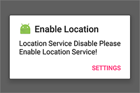
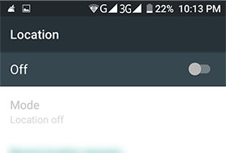

#Location Helper Demo#
A location helper demo that let you get device current location using fused location provider (i.e. works even in the absence of internet).  
(Fused Location Provider is a Google Play Service Location APIs).

##Introduction:##
This Demo Application will help you how to get device current location in your application's activity or fragment by added a few lines of code. For a working implementation please have a look at sample application _"[**LocationHelperDemo**](https://github.com/MuhammadMuzammilSharif/LocationHelperDemo)"_.

##Usage:##
To use Location helper Library for getting device current location you just need to add a few lines of code in your application:
###Prerequisites:###
1. Include library to build.gradle app level:

		compile 'com.muhammadmuzammilsharif.locationhelper:locationhelper:1.1.1'
if your application not using jcenter repository then add  
**_(only if in repositories session "jcenter()" is not included_**
		
		allprojects {
   			repositories {
      			maven { url "https://dl.bintray.com/muhammadmuzammilsharif/library" }
   			...
			}
		} 

2. Add permissions to manifest:

		<uses-permission android:name="android.permission.ACCESS_COARSE_LOCATION"/>
    	<uses-permission android:name="android.permission.ACCESS_FINE_LOCATION"/> 
    	<uses-permission android:name="android.permission.INTERNET"/>

###Include In Activity###
extend "**LocationActivity**"

		public class DemoLocationActivity extends LocationActivity { 
			...
		}

###Include In Fragment###
* **if activity in which the location needed fragment loaded not using location service then:**    
	
	extend "**_LocationFragment_**"

			public class DemoLocationFragment extends LocationFragment { 
				...
			}
* **if activity in which the location needed fragment loaded using location service then:**

	Implement **_OnLocationChangeListener_**

			public class MyFragment extends Fragment implements OnLocationChangeListener { 
				... 
			}
	and create an instance of **_OnLocationChangeListener_** in Location activity in which location needed fragment is loaded and initial in with the instance of fragment like:
		
			MyFragment mFragment = new MyFragment();
        	listener = (OnLocationChangeListener) mFragment;
			FragmentTransaction fragmentTransaction = getSupportFragmentManager().beginTransaction();
        	fragmentTransaction.add(R.id.fragment_location2, mFragment, "location_needed_fragment");
        	fragmentTransaction.commit();
	in Activity onLocationChanged Method call

			@Override
    		public void onLocationChanged(Location location) {
        		if (listener != null) {
            		listener.onLocationChanged(location);
        		}
				...
    		}

after extending location activity or fragment this will force you to override three methods

1. showNeededLocationPermissionDialog()
2. showLocationServiceEnableDialog()
3. onLocationChanged(Location location)
	
in these methods you have to show needed permission dialog and enable location service dialog: 
	
1. **showNeededLocationPermissionDialog()**

		@Override
    	protected void showNeededLocationPermissionDialog() {
        	//todo: add your logic here if you don't want this app ask for location permission again
			//todo: add your dailog here...
        	new AlertDialog.Builder(DemoLocationActivity.this).
           	    setCancelable(false).
	            setIcon(R.mipmap.ic_launcher).
	            setTitle("Permission Require").
	            setMessage("Location Permission Require Please Allow This App Location Permission!").
	            setPositiveButton("Settings", new DialogInterface.OnClickListener() {
	                @Override
	                public void onClick(DialogInterface dialogInterface, int i) {
	                    dialogInterface.dismiss();
						//todo: "openAppPermissionSettingToEnableLocation()" method will
						//open application info where in permission session user have to enable location service
	                    DemoLocationActivity.super.openAppPermissionSettingToEnableLocation(BuildConfig.APPLICATION_ID);
	                }
	            }).show();
		}

2. **showLocationServiceEnableDialog()**
	
		@Override
    	protected void showLocationServiceEnableDialog() {
    	   	//todo: add your logic here if you don't want this app ask for enable location service again
			//todo: add your dailog here...
        	new AlertDialog.Builder(DemoLocationActivity.this).
               	setCancelable(false).
	            setIcon(R.mipmap.ic_launcher).
    	        setTitle("Enable Location").
    	        setMessage("Location Service Disable Please Enable Location Service!").
    	        setPositiveButton("Settings", new DialogInterface.OnClickListener() {
    	            @Override
    	            public void onClick(DialogInterface dialogInterface, int i) {
    	                dialogInterface.dismiss();
						//todo: "openLocationServiceSetting()" method will open location service setting
    	                DemoLocationActivity.super.openLocationServiceSetting();
    	            }
    	        }).show();
    	}

 

3. **onLocationChanged(Location location)**

	this method call when current location updated.
###Other Methods:###

1. **openAppPermissionSettingToEnableLocation(String);** _non override method_

	This method open application info where user can see applications permissions, storage and etc.   
	This method require a string parameter that should be:
	 	
		YOUR_APPICATION_PACKAGE_NAME.BuildConfig.APPLICATION_ID;

 
 
2. **openLocationServiceSetting();** _non override method_
	
	This method open location service setting 

3. **startLocationService();** _non override method_
	
	This method start Location Service after location permission granted and enabling location service and start getting current location. 

4. **stopLocationService();** _non override method_  
	
	This method stop Location Service and stop getting current location.

there are some screen shots of demoLcoationHelper Application bellow: 

* Getting Device Current Location in activity.  
  
* Getting Device Current Location in Fragment Only.  
 
* Getting Device Current Location in both activity and Fragment.  

##Licence##

Copyright (C) 2017 Muhammad Muzammil Sharif

Licensed under the Apache License, Version 2.0 (the "License");
you may not use this file except in compliance with the License.
You may obtain a copy of the License at

http://www.apache.org/licenses/LICENSE-2.0

 Unless required by applicable law or agreed to in writing, software  
 distributed under the License is distributed on an "AS IS" BASIS,  
 WITHOUT WARRANTIES OR CONDITIONS OF ANY KIND, either express or implied.  
 See the License for the specific language governing permissions and
 limitations under the License.